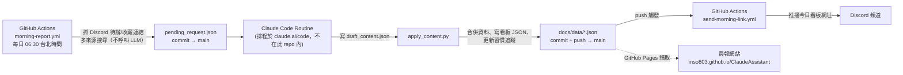

# 個人 AI 助手

邱彥碩的個人 AI 助手專案：長期記憶系統 + 晨報自動化系統。詳細專案背景與執行原則見
[CLAUDE.md](CLAUDE.md)。

> 這份文件只放「這是什麼、架構長怎樣、怎麼跑起來」。
> 每個階段做了什麼改動 → 看 [CHANGELOG.md](CHANGELOG.md)。
> 還沒做的事 / 待辦 → 看 [TODO.md](TODO.md)（之後會遷移到 GitHub Issues）。

## 架構總覽

三段接力 pipeline，關注點分離：資料蒐集不碰 LLM、寫內容不碰 secret、推播不碰內容邏輯。



- **第一段**（`morning_report/collect_report_request.py`，GitHub Actions 排程）：純資料蒐集，不呼叫任何 LLM
- **第二段**（Claude Code routine，**不在這個 repo 裡**，設定在 claude.ai/code/routines）：讀 repo 裡的資料寫內容，用 Claude Code 訂閱額度，不是計費 API
- **`apply_content.py`**：把 routine 寫的內容跟第一段蒐集的決定性資料（天氣、行程、待辦、統計數字）合併，寫進 `docs/data/`，commit + push
- **第三段**（`morning_report/send_today_link.py`，GitHub Actions 監聽 `docs/data/**` 變動）：推當天看板網址到 Discord
- **前端**：GitHub Pages 靜態頁面（`docs/`），支援 `?date=YYYY-MM-DD` 回看歷史，資料保留 30 天自動清除

> ⚠️ 第二段的 Claude Code routine prompt 目前只存在 claude.ai 上，這個 repo 看不到它的版本紀錄。
> 建議每次改動 routine prompt，同步存一份到 `docs/routine-prompt.md`（見 TODO.md）。

## 專案結構

```
memory/                     長期記憶（見 memory/README.md）
  profile.md                 使用者核心背景摘要
  habits.md                  自我提升進度追蹤（人類可讀版）
  interests.md                興趣收藏清單（人類可讀版，從 Discord 累積）
  feedback.md                使用者對晨報的回饋紀錄
  import_gemini_takeout.py   把 Google Takeout 匯出檔解析成純文字
  raw/                        原始匯出檔（.gitignore 排除）

morning_report/              晨報系統（兩段接力，見上方架構圖）
  collect_report_request.py   第一段（GitHub Actions）：抓 Discord 待辦/收藏連結、多來源搜尋，
                                 不呼叫任何 LLM，寫成 morning_report/state/pending_request.json
  apply_content.py             第二段機械部分（Claude Code routine 執行）：把 routine 寫的
                                 draft_content.json 跟 pending_request.json 合併、寫看板資料、
                                 更新習慣追蹤、commit + push 回 main
  send_today_link.py           第三段（GitHub Actions，docs/data/** 有變動就觸發）：推 Discord 連結
  memory_reader.py            讀取 memory/ 的內容
  interests.py                 興趣收藏清單持久化（Discord 內容累積進 memory/）
  recommender.py               根據興趣清單找相關新內容（多來源搜尋彙整，不呼叫 LLM）
  content_generator.py        `ReportContent` 資料結構；GROQ_URL 常數留給 link_processor.py 用
  habit_tracker.py            把追蹤狀態寫回 memory/
  board_writer.py              把當天內容寫進 docs/data/（含歷史紀錄、期數、自動清超過 30 天）
  discord_push.py              把「今天晨報網址」推到 Discord 頻道（取代 ver1 的 LINE 推播）
  sources/                     內容來源：
                                  discord_source.py（今日/長期待辦、收藏連結，calendar + 長期待辦
                                  頻道 + interesting-links 頻道）
                                  hn_source.py（Hacker News，Algolia API，免金鑰）
                                  google_news_source.py（Google 新聞 RSS，免金鑰）
                                  youtube_source.py（YouTube Data API v3，需要 YOUTUBE_API_KEY，
                                  含縮圖 thumbnail）
                                  devpost_source.py（Devpost 黑客松，免金鑰、非官方端點）
                                  eventbrite_source.py（Eventbrite 活動，需要 EVENTBRITE_API_TOKEN，
                                  但 Eventbrite 已停用第三方公開搜尋 API，實際多半查不到結果）
  state/                       機器可讀狀態（habit_state.json、interests_state.json、
                                 issue_counter.json、pending_request.json/draft_content.json 是
                                 兩段接力交接用的暫存檔，處理完就刪）
  link_processor.py            interesting-links 頻道的深度處理：抓連結→逐字稿/文字摘要→回覆到 Discord
                                （這幾次重建都沒有動這支，唯一還在用 Groq 的地方）

docs/                        GitHub Pages 靜態頁面（Broadsheet 報紙風，main 分支 /docs 路徑部署）
  index.html / style.css / broadsheet.css / script.js
                                看板頁面，支援 ?date=YYYY-MM-DD 往回翻歷史；broadsheet.css 是設計
                                系統 token + 共用元件，style.css 是這個頁面專屬版面
  data/latest.json            今天的內容（每次晨報產生後覆寫，網頁沒帶 ?date= 時預設讀這份）
  data/{date}.json            每一天各自一份，超過 30 天自動被清掉
  data/manifest.json          目前還保留著的日期清單（新到舊），給看板頁面畫歷史導覽用

design_handoff_morning_brief/README.md
                              Broadsheet 視覺規格的設計交接文件（保留當歷史紀錄；design/ 底下的
                              設計工具檔案沒有進版控）

.github/workflows/
  morning-report.yml          每日排程（第一段）：蒐集資料、把結果 commit 回 repo
  send-morning-link.yml       docs/data/** 有變動就觸發（第三段）：推 Discord 連結
```

> 📌 這個列表跟 `.github/workflows/` 資料夾實際內容需要對一次：health check（2026-09-14）
> 發現 repo 裡目前只有以上兩個 workflow 檔案，但舊版 README 還記著第三個
> `interesting-links.yml`（每小時處理收藏連結）——請確認這個檔案是被移除了還是還沒 commit，
> 見 TODO.md。

## 本機測試

複製 `.env.example` 為 `.env` 並填入你的金鑰。主晨報流程分兩段，本機只能測第一段：

```powershell
pip install -r requirements.txt
python -m morning_report.collect_report_request
```

這段是純資料蒐集（讀 Discord、多來源搜尋），沒有金鑰的來源會自動跳過，不會呼叫任何 LLM。
第二段（寫內容）是排程的 Claude Code routine，本機沒辦法跑；要測試「寫內容 + 套用 + 推播」
這段，可以手動寫一份 `morning_report/state/draft_content.json`（欄位對照
`content_generator.py` 的 `ReportContent`），再跑：

```powershell
python -m morning_report.apply_content
```

⚠️ **注意**：`apply_content.py` 最後一步會 `git commit` + `git push origin HEAD:main`
——這是設計給 routine 用的，本機測試時如果不想真的 push 到 main，記得先確認目前的 git
狀態，或只呼叫這支腳本內部的個別函式驗證邏輯，不要整支跑。

⚠️ 另外，只要 `.env` 裡的 `DISCORD_BOT_TOKEN` 是真的有效 token，`send_today_link.py` /
`apply_content.py` 觸發的推播都是真的會送到 Discord 頻道，不是模擬。

執行後可以打開 `docs/index.html`（或用任何本機伺服器，例如 `python -m http.server` 在
`docs/` 資料夾下執行，直接用 `file://` 開會因為 fetch 本機 json 而失敗）看看看板頁面。

## 未來構想（先記錄，還沒要做）

- **自然語言記行程自動解析**：現在 `calendar` 頻道是「使用者自己打字、原封不動當成一行行程」，
  還沒有自動解析日期/時間欄位。使用者桌面上已經有一個 `smart-line-calendar` 專案
  （FastAPI + LINE Messaging API + Gemini API + SQLite）雛型，之後可能可以延伸這個做更精準的
  自然語言解析，取代現在單純轉述訊息內容的做法，但屬於獨立專案，整合方式還沒定案
